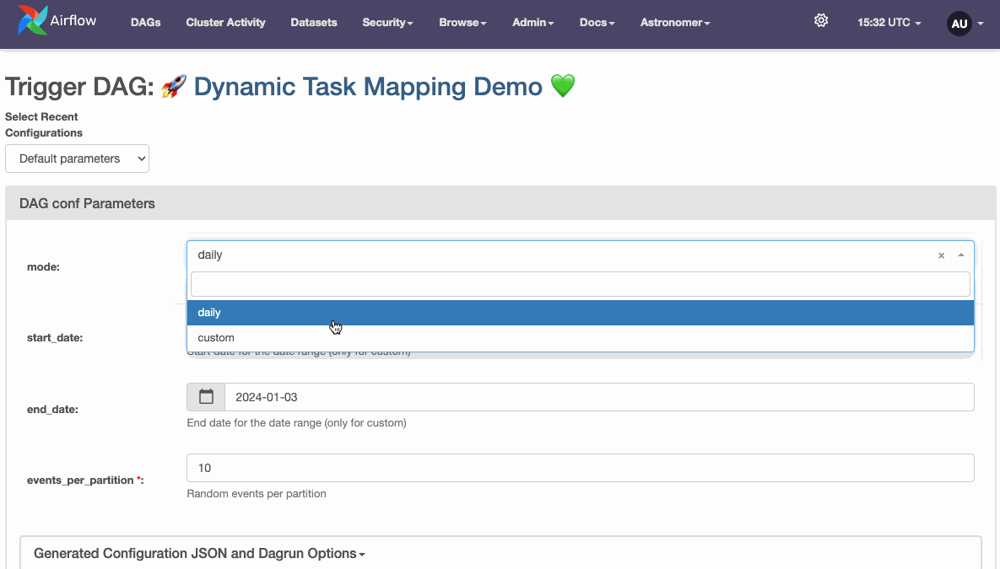
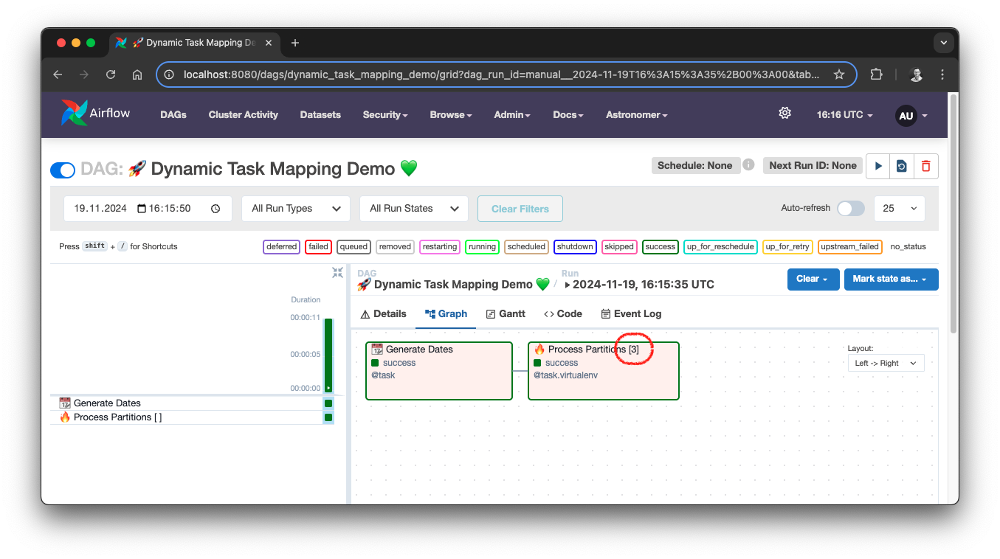

# Dynamic Task Mapping Demo

This project showcases how to use Dynamic Task Mapping in Apache Airflow.

*Dynamic Task Mapping demo*

For details, please read my article: [Stop Creating Multiple Airflow DAGs for Reloads and Parallel Processing](https://medium.com/data-engineer-things/stop-creating-multiple-airflow-dags-for-reloads-and-parallel-processing-3912974b5866)

In this article, we’ll tackle a common challenge in Airflow development: the proliferation of nearly identical DAGs for
handling different data processing scenarios, especially those involving partitioned tables and historical reloads.
You’ll learn how to build a single, flexible DAG that leverages Dynamic Task Mapping to process partitions in parallel,
handling both daily operations and custom date range reloads with ease.

*Dynamic Task Mapping DAG*

The DAG uses [DuckDB](https://duckdb.org/) to write partitioned [Parquet files](https://parquet.apache.org/),
simulating a typical data partitioning scenario. The data is partitioned by day. The DAG implements two modes:
1. **Daily Mode:** Processes a single day's partition (regular scheduling scenario).
2. **Custom Mode:** Reprocesses a specified date range in parallel using Dynamic Task Mapping.

In addition to Dynamic Task Mapping, the example showcases these modern Airflow features:
* [TaskFlow API](https://airflow.apache.org/docs/apache-airflow/stable/tutorial/taskflow.html)
* DAG parameters
* Python Virtual Environment Operator

## Setup

1. Start Airflow on your local machine by running `astro dev start`.

This command will spin up 4 Docker containers on your machine, each for a different Airflow component:

- Postgres: Airflow's Metadata Database
- Webserver: The Airflow component responsible for rendering the Airflow UI
- Scheduler: The Airflow component responsible for monitoring and triggering tasks
- Triggerer: The Airflow component responsible for triggering deferred tasks

2. Verify that all 4 Docker containers were created by running `docker ps`.

Note: Running `astro dev start` will start your project with the Airflow Webserver exposed at port 8080 and Postgres
exposed at port 5432.

3. Access the Airflow UI for your local Airflow project. To do so, go to http://localhost:8080/ and log in with `admin` as user and password.
